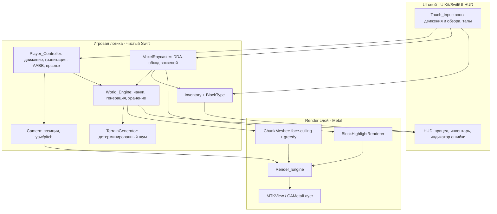

# Design Document

## Overview

`ios-voxel-game` — нативное iOS-приложение на **Swift**, реализующее воксельную песочницу в стиле Minecraft. Игрок попадает в процедурно сгенерированный мир из блоков, перемещается от первого лица с помощью сенсорного управления, разрушает и устанавливает блоки разных типов и управляет простым инвентарём. Сборка и упаковка приложения полностью автоматизированы через GitHub Actions на macOS-исполнителе с выпуском **неподписанного `.ipa`** в качестве артефакта.

### Ключевые технические решения

| Решение | Выбор | Обоснование |
|---|---|---|
| Язык | Swift | Нативная производительность, прямой доступ к Metal и UIKit, отсутствие зависимости от сторонних движков. |
| Рендеринг | **Metal** (основной конвейер) + минимальный UIKit/SwiftUI для HUD | Воксельный мир требует генерации собственной геометрии чанков и плотного контроля над буферами вершин и draw call'ами. Metal даёт прямой контроль над пайплайном, что необходимо для удержания ≥30 fps. SceneKit рассматривался, но его узел-ориентированный граф плохо подходит для десятков тысяч динамически перестраиваемых вокселей в одном чанке; накладные расходы на узлы превышают выгоду. Поэтому для рендеринга мира используется чистый Metal, а UIKit/SwiftUI — только для наложенного HUD (прицел, инвентарь, индикаторы). |
| Генерация ландшафта | Детерминированный value/Perlin-подобный шум на основе `World_Seed` | Требование 1.2 (детерминированность) и 1.6 (случайный сид). |
| Генерация меша чанка | Face-culling + greedy meshing | Требование 7.5 (≥30 fps) и 2.3 (быстрая перестройка). Сокращает число вершин за счёт объединения смежных граней одного типа. |
| CI | GitHub Actions, `macos`-runner, `xcodebuild` | Требование 8. |
| Артефакт | Неподписанный `.ipa` (ручная упаковка `Payload/`) | Явный выбор пользователя. |

### Важное примечание о неподписанном `.ipa`

CI-конвейер выпускает **неподписанный** `.ipa`: сборка выполняется с `CODE_SIGNING_ALLOWED=NO` и `CODE_SIGN_IDENTITY=""`, после чего `.app` вручную упаковывается в `.ipa` путём помещения его в каталог `Payload/` и архивирования в zip. Такой `.ipa` **не устанавливается на стандартные устройства iOS через App Store или TestFlight**. Для установки требуется сторонняя загрузка (sideloading) через инструменты подписи (AltStore, Sideloadly и т. п.) либо устройство с джейлбрейком. Это осознанный выбор пользователя: цель CI — собрать устанавливаемый артефакт без процедуры подписи Apple, а не дистрибутив для широкой аудитории.

## Architecture

Приложение разделено на слои с чёткими границами ответственности. Чистая игровая логика (генерация, хранение, коллизии, raycast, инвентарь) отделена от слоёв ввода-вывода (рендеринг, сенсорный ввод) — это упрощает property-based-тестирование логики без участия GPU и UIKit.



### Игровой цикл

Рендеринг управляется `CADisplayLink` (через `MTKViewDelegate`), нацеленным на 60 fps с допустимым порогом ≥30 fps (Требование 7.5). Каждый кадр:

1. **Ввод** — накопленные за кадр события `Touch_Input` применяются: вектор движения, дельта обзора, отложенные действия break/place.
2. **Обновление** — `Player_Controller` интегрирует движение и гравитацию (фиксированный шаг `dt`), разрешает AABB-коллизии; `World_Engine` подгружает/выгружает чанки относительно позиции игрока.
3. **Перестройка мешей** — «грязные» (изменённые) чанки перестраиваются (с бюджетом по времени на кадр, чтобы не превышать 100 мс на чанк и не ронять fps).
4. **Отрисовка** — `Render_Engine` выполняет frustum culling и рисует видимые чанки, прицел и выделение целевого блока.

## Components and Interfaces

### World_Engine

Отвечает за генерацию, хранение и обновление воксельного мира (Требования 1, 2, 4, 5).

```swift
typealias ChunkCoord = SIMD2<Int>      // (chunkX, chunkZ)
typealias BlockCoord = SIMD3<Int>      // мировые целочисленные координаты блока

struct WorldConfig {
    static let chunkSizeX = 16
    static let chunkSizeZ = 16
    static let chunkSizeY = 256
    static let initialRadius = 2       // 5x5 чанков => радиус 2 (Требование 1.1)
    static let loadMargin = 2          // подгрузка при приближении < 2 чанков (Требование 1.4)
}

protocol WorldEngine {
    init(seed: UInt64)
    var seed: UInt64 { get }

    /// Тип блока в мировых координатах (.air если пусто/вне диапазона по Y).
    func block(at coord: BlockCoord) -> BlockType

    /// Установить блок; помечает затронутый чанк "грязным". Возвращает успех.
    @discardableResult
    func setBlock(_ type: BlockType, at coord: BlockCoord) -> Bool

    /// Удалить блок (заменить на .air). Возвращает тип удалённого блока, либо nil.
    func removeBlock(at coord: BlockCoord) -> BlockType?

    /// Гарантировать, что чанки в радиусе вокруг позиции сгенерированы.
    func ensureChunksLoaded(around position: SIMD3<Float>)

    /// Доступ к чанку (для мешера). nil, если не сгенерирован.
    func chunk(at coord: ChunkCoord) -> Chunk?

    /// Чанки, помеченные "грязными" и нуждающиеся в перестройке меша.
    func consumeDirtyChunks() -> [ChunkCoord]

    /// Признак ошибки генерации (для индикации в HUD, Требование 1.7).
    var lastGenerationError: GenerationError? { get }
}
```

### TerrainGenerator

Детерминированная процедурная генерация (Требования 1.2, 1.5, 1.6).

```swift
protocol TerrainGenerator {
    init(seed: UInt64)
    /// Заполняет блоки чанка детерминированно по seed и координатам чанка.
    func generate(chunk coord: ChunkCoord) -> ChunkBlocks
}
```

Высота поверхности вычисляется как сумма октав value-noise, хэш которого детерминированно зависит только от `seed` и мировых координат столбца `(x, z)` — поэтому генерация одного и того же чанка независима от порядка загрузки. По высоте назначаются как минимум три поверхностных типа (трава/камень/песок) плюс земля и камень в глубине (Требование 1.5).

### ChunkMesher (Render слой)

Преобразует блоки чанка в геометрию Metal (Требования 2.3, 7.5).

```swift
struct ChunkMesh {
    var vertices: [VoxelVertex]   // позиция, нормаль, UV, индекс типа
    var indices: [UInt32]
}

protocol ChunkMesher {
    /// Строит меш: пропускает грани между двумя твёрдыми блоками (face culling)
    /// и объединяет смежные копланарные грани одного типа (greedy meshing).
    func buildMesh(for chunk: Chunk, neighbors: ChunkNeighborhood) -> ChunkMesh
}
```

Алгоритм основан на каноническом greedy-meshing'е (проход по трём осям X/Y/Z, для каждого слоя строится маска видимых граней, смежные ячейки маски с одинаковым типом объединяются в один квад). Источник подхода: [Meshing in a Minecraft Game, 0FPS](https://0fps.net/2012/06/30/meshing-in-a-minecraft-game/). Содержимое переработано для соответствия лицензионным ограничениям.

### Render_Engine (Metal)

Отрисовка от первого лица (Требование 7).

```swift
protocol RenderEngine {
    func updateCamera(_ camera: Camera)
    func uploadMesh(_ mesh: ChunkMesh, for coord: ChunkCoord)
    func discardMesh(for coord: ChunkCoord)
    func setHighlight(_ target: RaycastHit?)   // выделение целевого блока
    func drawFrame()                            // frustum culling + draw calls
    var lastFrameFPS: Double { get }
}
```

- Frustum culling исключает чанки вне поля зрения (Требование 2.4).
- Прицел (Требование 7.2) и выделение целевого блока (7.3/7.4) рисуются отдельными пайплайнами поверх мира.
- Каждый `BlockType` отображается отличимым цветом/текстурой через индекс типа в вершине (Требование 6.5).

### Player_Controller

Движение, гравитация, коллизии, прыжок (Требование 3).

```swift
struct PlayerState {
    var position: SIMD3<Float>     // позиция "глаз"/тела
    var velocity: SIMD3<Float>
    var yaw: Float                 // поворот по горизонтали
    var pitch: Float               // наклон, ограничен [-90°, +90°]
    var onGround: Bool
}

struct PlayerAABB {                // габариты игрока для коллизий
    static let halfWidth: Float = 0.3
    static let height: Float = 1.8
}

protocol PlayerController {
    var state: PlayerState { get }
    /// moveInput: вектор из зоны движения [-1,1]^2; lookDelta: дельта из зоны обзора.
    func update(dt: Float, moveInput: SIMD2<Float>, lookDelta: SIMD2<Float>,
                jump: Bool, world: WorldEngine)
}
```

- Гравитация — постоянное ускорение вниз (3.3); прыжок задаёт начальную вертикальную скорость, дающую подъём на 1–2 блока (3.5).
- Коллизии разрешаются по осям отдельно (swept-AABB по X, затем Z, затем Y) против твёрдых блоков, останавливая движение на границе блока (3.4).
- Pitch ограничивается диапазоном [−90°, +90°] (3.6).

### VoxelRaycaster

Обход вокселей лучом из камеры для break/place (Требования 4.5, 5.5).

```swift
struct RaycastHit {
    let blockCoord: BlockCoord     // первый твёрдый блок на пути луча
    let faceNormal: BlockCoord     // нормаль грани, обращённой к камере
}

protocol VoxelRaycaster {
    /// DDA-обход вокселей от origin вдоль direction до maxDistance (Reach_Distance ≤ 5).
    func raycast(origin: SIMD3<Float>, direction: SIMD3<Float>,
                 maxDistance: Float, world: WorldEngine) -> RaycastHit?
}
```

Используется алгоритм обхода сетки Amanatides–Woo (DDA): шаг по той оси, граница которой ближе, что гарантирует возврат **первого** твёрдого блока на пути луча и нормали пересечённой грани.

### Block break/place — взаимодействие

```swift
protocol Interaction {
    /// Разрушение: raycast -> удалить блок -> пополнить инвентарь (Требование 4).
    func breakBlock(camera: Camera, world: WorldEngine, inventory: Inventory)
    /// Установка: raycast -> ячейка у обращённой грани -> разместить (Требование 5).
    func placeBlock(camera: Camera, world: WorldEngine, inventory: Inventory,
                    playerAABB: (SIMD3<Float>) -> Bool)  // проверка пересечения с игроком
}
```

### Inventory + BlockType

Система типов блоков и инвентаря (Требование 6).

```swift
enum BlockType: UInt8, CaseIterable {
    case air = 0
    case grass, dirt, stone, sand, wood, water   // ≥ 5 устанавливаемых типов
    var isSolid: Bool { self != .air && self != .water }
    var isPlaceable: Bool { self != .air }
}

struct InventorySlot {
    let type: BlockType
    var count: Int           // 0...999
}

protocol Inventory {
    var slots: [InventorySlot] { get }     // ≥ 5 слотов, по одному на тип
    var selectedType: BlockType { get }

    func selectSlot(at index: Int)          // выбор Selected_Block_Type (6.4)
    @discardableResult func add(_ type: BlockType) -> Bool   // +1, максимум 999 (4.3/4.4)
    @discardableResult func consume(_ type: BlockType) -> Bool // -1, если >0 (5.3)
    func count(of type: BlockType) -> Int
}
```

## Data Models

### Chunk и хранение мира

```swift
/// Плотный массив блоков чанка: индекс = x + z*16 + y*16*16.
struct ChunkBlocks {
    var storage: [BlockType]      // размер 16*16*256
    func block(localX: Int, y: Int, localZ: Int) -> BlockType
    mutating func set(_ t: BlockType, localX: Int, y: Int, localZ: Int)
}

final class Chunk {
    let coord: ChunkCoord
    var blocks: ChunkBlocks
    var isDirty: Bool             // нужна перестройка меша
    var isModified: Bool          // изменён игроком (хранить на сессию, Требование 2.5)
}
```

- Мир хранится как словарь `[ChunkCoord: Chunk]` в памяти на протяжении всей сессии (Требования 2.1, 2.5).
- Чанки вне поля зрения **не выгружаются из памяти**, если `isModified == true`; их геометрия исключается из отрисовки, но состояние блоков сохраняется (2.4, 2.5, 2.6).
- Координаты блока — целочисленные `(x, y, z)`; преобразование мир→чанк: `chunkX = floor(x/16)`, `localX = x mod 16` (с корректной обработкой отрицательных).

### Camera

```swift
struct Camera {
    var position: SIMD3<Float>
    var yaw: Float
    var pitch: Float               // [-90°, +90°]
    var forward: SIMD3<Float> { /* из yaw/pitch */ }
    func viewProjection(aspect: Float) -> matrix_float4x4
    static let reachDistance: Float = 5.0   // Reach_Distance
}
```

### GenerationError

```swift
enum GenerationError: Error { case chunkGenerationFailed(ChunkCoord, underlying: Error) }
```

Используется для индикации ошибки генерации без потери ранее сгенерированных чанков (Требование 1.7).

## Correctness Properties

*Свойство (property) — это характеристика или поведение, которое должно выполняться для всех допустимых исполнений системы; по сути, формальное утверждение о том, что система должна делать. Свойства служат мостом между человекочитаемой спецификацией и проверяемыми машиной гарантиями корректности.*

Ниже приведены универсально квантифицированные свойства, выведенные из тестируемых критериев приёмки (см. prework-анализ). Каждое реализуется одним property-based-тестом.

### Property 1: Детерминированность генерации

*Для любого* `World_Seed` и любых координат чанка генерация одного и того же чанка два раза (в том числе в разном порядке относительно других чанков) даёт идентичное расположение блоков.

**Validates: Requirements 1.2**

### Property 2: Начальная область сгенерирована

*Для любого* `World_Seed` после старта новой игры все чанки в области не менее 5×5 вокруг точки появления загружены (не nil).

**Validates: Requirements 1.1**

### Property 3: Подгрузка соседних чанков у границы

*Для любой* позиции игрока, оказавшейся ближе двух чанков к границе сгенерированной области, после обновления мира соседние чанки в требуемом радиусе становятся загруженными.

**Validates: Requirements 1.4**

### Property 4: Инвариант размера чанка

*Для любого* сгенерированного чанка число блоков в его хранилище равно 16×16×256, а все индексы корректно отображаются между локальными и линейными координатами.

**Validates: Requirements 1.3**

### Property 5: Разнообразие поверхности

*Для любого* `World_Seed`, на достаточно большой сгенерированной области множество типов верхних твёрдых блоков содержит не менее трёх различных `Block_Type`.

**Validates: Requirements 1.5**

### Property 6: Round-trip хранилища блоков

*Для любого* `Block_Type` и любых целочисленных координат в допустимом диапазоне, запись блока с последующим чтением по тем же координатам возвращает записанный тип; ранее установленные блоки в других координатах при этом не меняются.

**Validates: Requirements 2.1**

### Property 7: Сохранность изменённых невидимых чанков

*Для любых* изменений блоков в чанке, который затем выходит из поля зрения камеры, состояние блоков этого чанка остаётся неизменным и доступным при повторном попадании в зону видимости.

**Validates: Requirements 2.5, 2.6**

### Property 8: Исключение невидимых чанков из отрисовки

*Для любой* камеры и любого набора чанков ни один чанк, полностью находящийся вне усечённой пирамиды видимости (frustum), не попадает в список отрисовываемых чанков.

**Validates: Requirements 2.4**

### Property 9: Корректность face-culling и greedy-меша

*Для любого* чанка построенный меш не содержит граней между двумя смежными твёрдыми блоками (внутренние грани отсутствуют), и множество видимых граней greedy-меша покрывает ровно те же поверхности, что и наивный per-face-алгоритм (одинаковая суммарная площадь и ориентация граней).

**Validates: Requirements 2.3, 2.6, 7.5**

### Property 10: Ограничение горизонтальной скорости

*Для любого* ввода движения результирующая горизонтальная скорость игрока находится в диапазоне от 0 до 4 блоков в секунду.

**Validates: Requirements 3.1**

### Property 11: Пропорциональность поворота камеры

*Для любой* дельты перетаскивания в зоне обзора изменение углов yaw и pitch совпадает по знаку с направлением перетаскивания и пропорционально его величине (до применения ограничения pitch).

**Validates: Requirements 3.2**

### Property 12: Гравитация

*Для любого* игрока, не опирающегося на твёрдую поверхность, после шага интегрирования `dt` его вертикальная скорость уменьшается на величину `g·dt` (ускорение направлено вниз).

**Validates: Requirements 3.3**

### Property 13: Инвариант коллизий (непроникновение)

*Для любого* мира и любой последовательности вводов движения AABB игрока после обновления никогда не пересекает твёрдый блок: при столкновении движение по соответствующей оси останавливается на границе блока.

**Validates: Requirements 3.4**

### Property 14: Высота прыжка

*Для любого* прыжка, начатого с твёрдой поверхности, максимальный прирост высоты игрока до начала падения находится в диапазоне от 1 до 2 блоков.

**Validates: Requirements 3.5**

### Property 15: Ограничение угла наклона камеры

*Для любой* последовательности дельт обзора угол pitch камеры остаётся в диапазоне от −90 до +90 градусов.

**Validates: Requirements 3.6**

### Property 16: Корректность voxel-raycast

*Для любого* мира, начала и направления луча, если raycast возвращает попадание, то это первый твёрдый блок вдоль луча в пределах `Reach_Distance` (все воксели до него — не твёрдые), а возвращаемая нормаль соответствует грани, обращённой к источнику луча.

**Validates: Requirements 4.5, 5.5**

### Property 17: Разрушение твёрдого блока

*Для любого* мира, в котором перед камерой в пределах `Reach_Distance` находится твёрдый блок, выполнение действия разрушения удаляет именно этот блок (он становится `air`).

**Validates: Requirements 4.1**

### Property 18: Промах луча не изменяет состояние

*Для любого* мира, в котором перед камерой в пределах `Reach_Distance` нет твёрдого блока, действия разрушения и установки оставляют состояние мира и инвентаря неизменными.

**Validates: Requirements 4.2, 5.6**

### Property 19: Границы инвентаря (насыщающее изменение)

*Для любого* слота `Inventory`: операция пополнения увеличивает количество на единицу, но не выше 999; операция расходования уменьшает количество на единицу только при положительном значении; количество всегда остаётся в диапазоне 0…999.

**Validates: Requirements 4.3, 4.4, 5.3**

### Property 20: Установка блока у обращённой грани

*Для любого* попадания луча в твёрдый блок при количестве `Selected_Block_Type` не менее единицы, новый блок размещается в ячейке, примыкающей к обращённой к камере грани (координата `target + faceNormal`), при условии, что эта ячейка была свободна и не пересекает объём игрока; количество `Selected_Block_Type` уменьшается на единицу.

**Validates: Requirements 5.1, 5.3**

### Property 21: Отмена недопустимой установки

*Для любой* целевой ячейки, которая занята твёрдым блоком или пересекает объём игрока, либо при количестве `Selected_Block_Type`, равном нулю, действие установки не изменяет состояние мира и количество `Selected_Block_Type`.

**Validates: Requirements 5.2, 5.4**

### Property 22: Выбор слота назначает выбранный тип

*Для любого* допустимого индекса слота выбор этого слота назначает его `Block_Type` как `Selected_Block_Type` независимо от количества блоков в слоте (в том числе при нулевом количестве).

**Validates: Requirements 6.4**

### Property 23: Различимость отображения типов

*Для любой* пары различных `Block_Type` их визуальное представление (цвет/текстура) различается — отображение «тип → цвет/текстура» инъективно.

**Validates: Requirements 6.5**

## Error Handling

| Ситуация | Обработка | Требование |
|---|---|---|
| Сбой генерации одного чанка | `TerrainGenerator` бросает ошибку; `World_Engine` ловит её, прекращает загрузку только этого чанка, сохраняет ранее сгенерированные, выставляет `lastGenerationError`; HUD показывает индикатор ошибки. | 1.7 |
| Запрос блока вне диапазона по Y | `block(at:)` возвращает `.air` (нет исключения), запись вне диапазона игнорируется. | 2.1 |
| Raycast не находит блок | `raycast` возвращает `nil`; break/place — no-op; выделение скрыто. | 4.2, 5.6, 7.4 |
| Установка в занятую ячейку / пересечение с игроком | Установка отменяется без изменения инвентаря. | 5.4 |
| Переполнение/опустошение слота инвентаря | Насыщение на границах 0 и 999. | 4.4, 5.3 |
| Перестройка меша превышает бюджет кадра | Перестройка распределяется по кадрам с бюджетом по времени, чтобы удерживать fps; «грязные» чанки обрабатываются по приоритету видимости. | 2.3, 7.5 |
| Падение fps ниже целевого | Ограничение дальности прорисовки (число загружаемых чанков) и frustum culling снижают нагрузку. | 7.5 |

## Testing Strategy

Используется двойной подход: property-based-тесты для универсальных свойств логики и unit/интеграционные тесты для конкретных примеров, граничных случаев и инфраструктуры.

### Property-based-тесты

- **Библиотека:** [SwiftCheck](https://github.com/typelift/SwiftCheck) (property-based-тестирование для Swift). Реализацию PBT с нуля не пишем.
- **Итерации:** каждый property-тест выполняется не менее **100 итераций**.
- **Тегирование:** каждый тест помечается комментарием со ссылкой на свойство дизайна в формате:
  `// Feature: ios-voxel-game, Property {number}: {property_text}`
- **Покрытие:** каждое из свойств 1–23 реализуется ОДНИМ property-based-тестом.
- **Генераторы:** случайные `World_Seed`, координаты блоков/чанков, последовательности вводов движения и обзора, лучи (origin/direction), состояния инвентаря, чанки со случайным заполнением блоков (включая граничные случаи: пустой чанк, полностью заполненный, отрицательные координаты, не-ASCII не применимо). Генераторы покрывают edge-cases из prework (насыщение инвентаря 999/0, pitch за пределами диапазона, луч в пустоту).
- **Изоляция:** логика (`World_Engine`, `TerrainGenerator`, `VoxelRaycaster`, `Player_Controller`, `ChunkMesher`, `Inventory`) тестируется без GPU и UIKit. Свойство 8 (frustum) и 9 (мешер) проверяются на чистых структурах данных, без вызовов Metal.

### Unit-тесты (примеры и граничные случаи)

- Случайный seed при старте без заданного `World_Seed` (1.6).
- Инициализация инвентаря: первый слот выбран при старте (6.3); число слотов ≥ 5 (6.2); ≥ 5 устанавливаемых типов (6.1).
- Отображение бейджа количества: показ для 1…999, скрытие при 0 (6.6, 6.7).
- Прицел в центре экрана (7.2); выделение целевого блока при наличии hit и его отсутствие при промахе (7.3, 7.4).
- Обработка ошибки генерации чанка с мок-генератором (1.7).

### Интеграционные и смоук-тесты

- Запуск приложения и отрисовка от первого лица (7.1).
- Замеры производительности: генерация чанка ≤ 200 мс (1.8), обновление чанка ≤ 100 мс (2.2), перестройка меша ≤ 100 мс (2.3), средний fps ≥ 30 (7.5) — выполняются на поддерживаемом устройстве/в профилировании, не как PBT.

### CI (GitHub Actions) — Требование 8

PBT к конфигурации CI не применяется (это декларативная конфигурация конвейера). Корректность проверяется запуском workflow и контролем артефакта.

Конвейер (`.github/workflows/ios-build.yml`):

- **Триггеры:** `push` в основную ветку и `pull_request` в основную ветку (8.1, 8.2). Сборка стартует на `macos`-исполнителе.
- **Фиксация версий:** жёстко закреплённые версии инструментов через `xcode-select`/`maxim-lobanov/setup-xcode` с указанием точной версии Xcode (мажорная.минорная.патч) и фиксацией версий зависимостей (например, через закреплённый `Package.resolved` для SwiftCheck) (8.7).
- **Сборка без подписи (8.6):**
  ```bash
  xcodebuild \
    -scheme VoxelGame \
    -configuration Release \
    -sdk iphoneos \
    -archivePath build/VoxelGame.xcarchive \
    clean archive \
    CODE_SIGNING_ALLOWED=NO \
    CODE_SIGNING_REQUIRED=NO \
    CODE_SIGN_IDENTITY="" \
    CODE_SIGN_ENTITLEMENTS=""
  ```
- **Ручная упаковка неподписанного `.ipa`:** так как `exportArchive` требует профили подписи, `.ipa` собирается вручную из `.app` внутри архива:
  ```bash
  mkdir -p Payload
  cp -R build/VoxelGame.xcarchive/Products/Applications/VoxelGame.app Payload/
  zip -r VoxelGame-unsigned.ipa Payload
  ```
  Подход подтверждён практикой сборки неподписанных `.ipa` через `CODE_SIGNING_ALLOWED=NO` и ручную упаковку `Payload/` ([StackOverflow: unsigned IPA с Xcode](https://stackoverflow.com/questions/78653409/how-to-archive-ios-app-and-export-unsigned-ipa-with-xcode-15-4)). Содержимое переработано для соответствия лицензионным ограничениям.
- **Тесты в PR:** на `pull_request` дополнительно выполняется `xcodebuild test` (юнит- и property-тесты) для проверки компилируемости и корректности (8.2).
- **Артефакт:** `VoxelGame-unsigned.ipa` загружается через `actions/upload-artifact` с `retention-days: 30` (8.3).
- **Ошибки и таймаут:** при ошибке компиляции `xcodebuild` возвращает ненулевой код — job помечается неуспешным, лог содержит причину (8.4); на job задаётся `timeout-minutes: 30` для прерывания зависшей сборки (8.5).

> Напоминание: получаемый `.ipa` неподписан и устанавливается только через sideloading или на устройства с джейлбрейком — это явный выбор пользователя.
